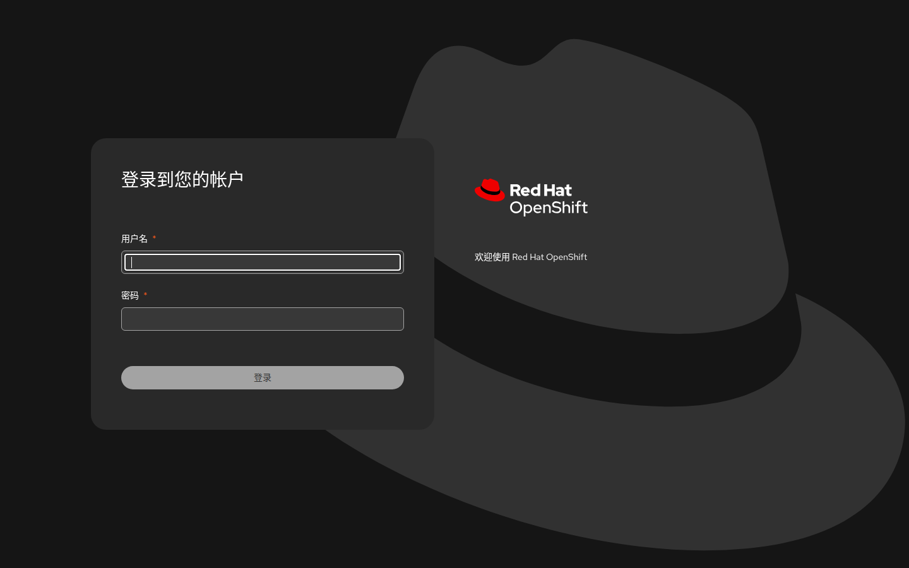
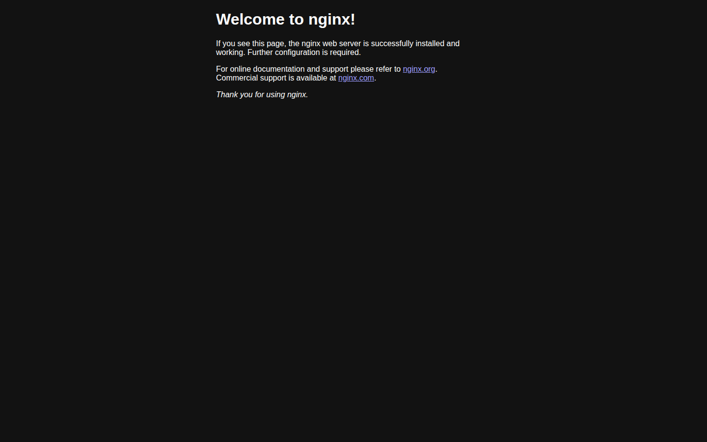
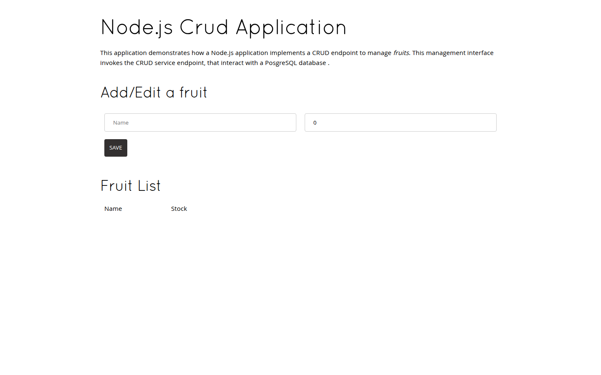
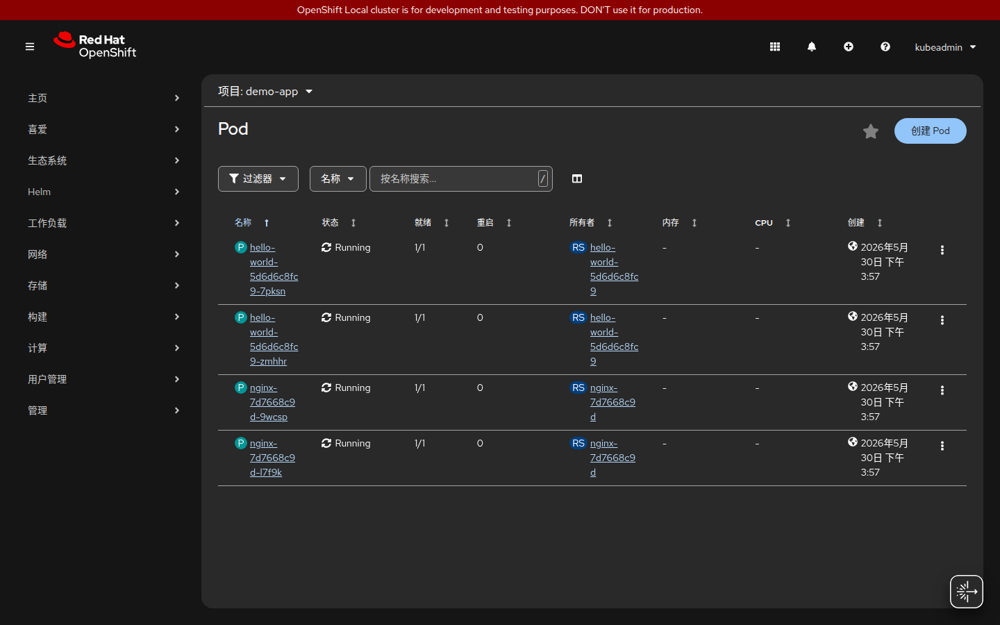
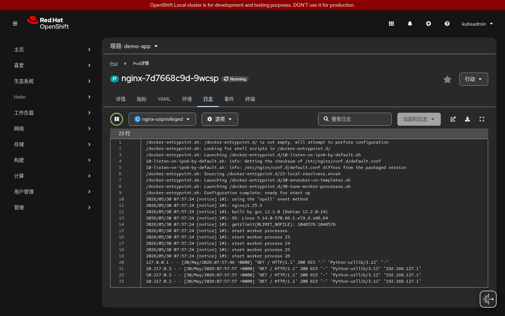
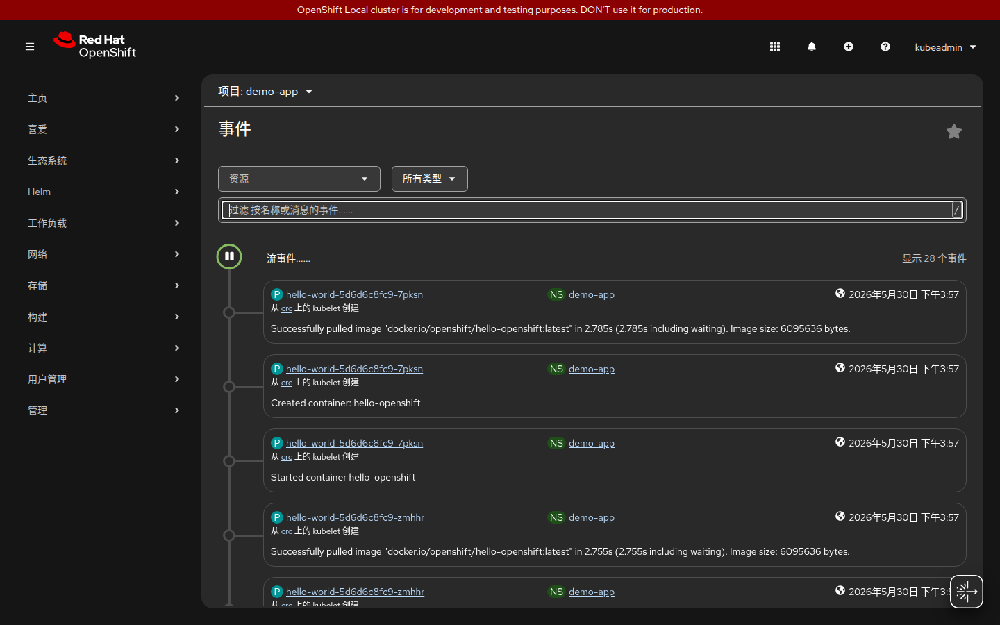
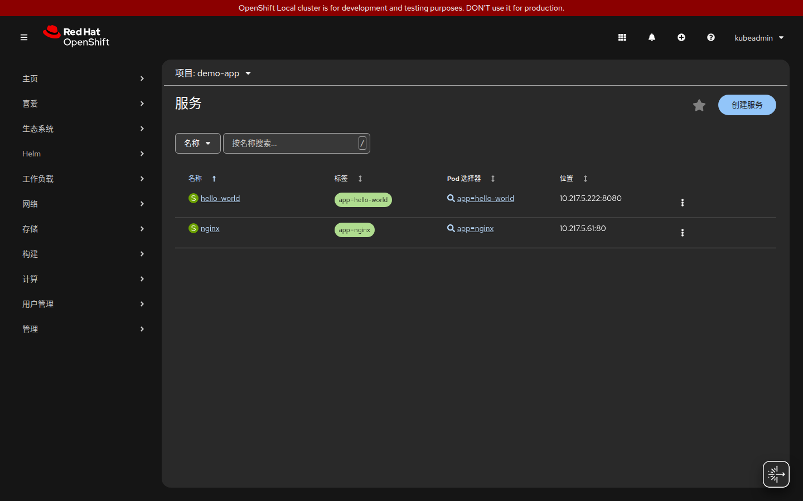
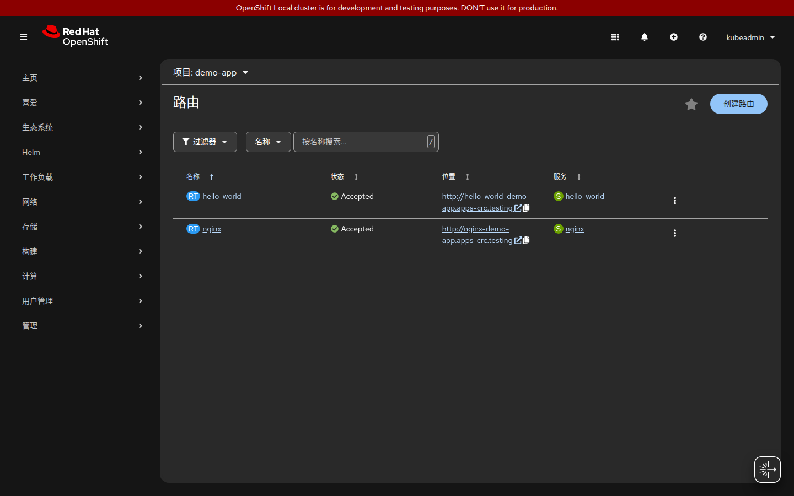
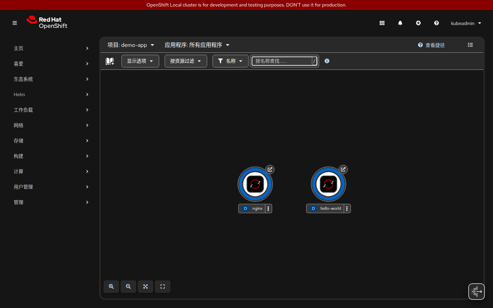
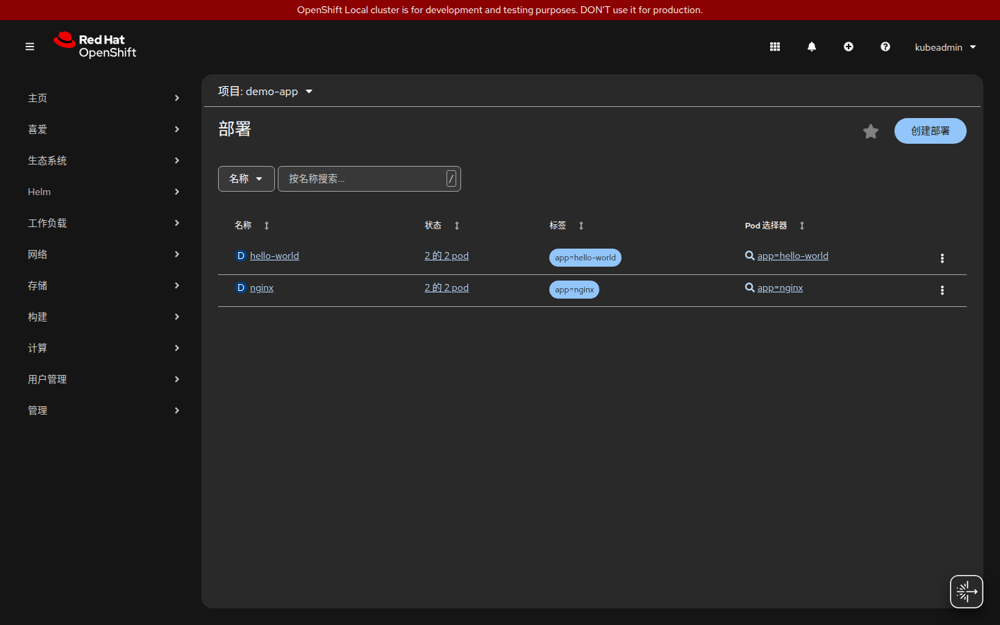

# OpenShift Local 完整學習教程

> 本教程適合初學者，從零開始理解 Kubernetes 與 OpenShift 的架構與概念，並透過 OpenShift Local (CRC) 在本機實作。
>
> **驗證環境**：OpenShift Local v2.61.0 · OpenShift v4.20.5 · Linux (GNOME/Wayland) · 2026-05-30

## 分支說明

本 Repository 依技術方向分為三個分支：

| 分支 | 內容 | 技術棧 |
|------|------|--------|
| **`main`**（本分支） | OpenShift 基礎教程（第 1-15 章） | K8s / OpenShift 核心概念與實戰 |
| **`spring-cloud`** | Spring PetClinic 微服務完整部署 | Spring Cloud Config Server + Eureka + Gateway + S2I |
| **`istio`** | 移除 Spring Cloud 基礎設施，改用 K8s 原生 + Istio | Istio Gateway + Prometheus + Grafana + Jaeger + Kiali |

```
main ──────────────────────────────────────────── OpenShift 基礎（章節 1-15）
  │
  ├── spring-cloud ──────────────────────────── PetClinic + Spring Cloud 全棧
  │     Config Server · Eureka · Gateway
  │     7 個微服務 · Spring Boot Admin
  │
  └── istio ─────────────────────────────────── PetClinic + Istio Service Mesh
        Istio IngressGateway · VirtualService
        Prometheus · Grafana · Jaeger · Kiali
```

## 基礎教程驗證狀態（本分支）

| 章節 | 內容 | 狀態 |
|------|------|------|
| 第 8 章 | Nginx + Hello World 部署、Service、Route | ✅ 通過 |
| 第 9 章 | S2I 從 GitHub 建置 Node.js 應用 | ✅ 通過 |
| 第 10 章 | ConfigMap + Secret 注入環境變數 | ✅ 通過 |
| 第 11 章 | PVC 持久化儲存，寫入驗證 | ✅ 通過 |
| 第 12 章 | HPA 建立，min=2 max=5 | ✅ 通過 |
| 第 13 章 | 日誌查看、port-forward、事件監控 | ✅ 通過 |
| 第 14 章 | Pod 間網路通訊、DNS 發現、NetworkPolicy、TLS Route | ✅ 通過 |

## 實際執行截圖

### Web Console 登入頁



### 第 8 章：Nginx 部署成功



> 透過 Route `nginx-demo-app.apps-crc.testing` 存取，HTTP 200

### 第 8 章：Hello OpenShift! 回應


> `hello-world-demo-app.apps-crc.testing` 回應 "Hello OpenShift!"

### 第 9 章：S2I 建置的 Node.js 應用



> 從 GitHub openshift/nodejs-ex 原始碼，S2I 自動建置並部署，耗時約 2 分鐘

---

## 目錄

1. [為什麼需要容器編排？](#1-為什麼需要容器編排)
2. [Kubernetes 核心架構](#2-kubernetes-核心架構)
3. [OpenShift vs Kubernetes：差異與增強](#3-openshift-vs-kubernetes差異與增強)
4. [OpenShift Local 安裝與啟動](#4-openshift-local-安裝與啟動)
5. [叢集角色與權限模型 (RBAC)](#5-叢集角色與權限模型-rbac)
6. [核心資源物件詳解](#6-核心資源物件詳解)
7. [OpenShift 專屬功能](#7-openshift-專屬功能)
8. [實戰：部署第一個應用程式](#8-實戰部署第一個應用程式)
9. [實戰：Source-to-Image (S2I) 建置](#9-實戰source-to-image-s2i-建置)
10. [實戰：ConfigMap 與 Secret 管理](#10-實戰configmap-與-secret-管理)
11. [實戰：持久化儲存 (PV/PVC)](#11-實戰持久化儲存-pvpvc)
12. [實戰：水平自動擴縮 (HPA)](#12-實戰水平自動擴縮-hpa)
13. [監控與日誌](#13-監控與日誌)
14. [網路模型與路由](#14-網路模型與路由)
15. [常用指令速查表](#15-常用指令速查表)

---

## 1. 為什麼需要容器編排？

### 容器的問題

單一容器可以解決「在我機器上沒問題」的問題，但當應用程式規模擴大時：

```
傳統部署痛點：
┌─────────────────────────────────────────┐
│  • 一台主機掛掉 → 服務中斷               │
│  • 流量暴增 → 手動新增主機，耗時費力      │
│  • 版本更新 → 停機維護                   │
│  • 10 個服務 × 10 台主機 = 100 個容器   │
│    手動管理根本不可能                     │
└─────────────────────────────────────────┘
```

### 容器編排解決的問題

```
容器編排平台（Kubernetes / OpenShift）：
┌─────────────────────────────────────────┐
│  ✓ 自動排程：決定容器跑在哪台主機         │
│  ✓ 自我修復：容器掛掉自動重啟            │
│  ✓ 自動擴縮：依流量增減容器數量          │
│  ✓ 滾動更新：零停機更新應用程式          │
│  ✓ 服務發現：容器間自動找到彼此          │
│  ✓ 負載均衡：流量自動分散到多個容器      │
└─────────────────────────────────────────┘
```

---

## 2. Kubernetes 核心架構

### 叢集整體架構

```
┌──────────────────────────────────────────────────────┐
│                   Kubernetes 叢集                     │
│                                                      │
│  ┌─────────────────────────────────────────────┐    │
│  │              Control Plane（控制平面）         │    │
│  │                                             │    │
│  │  ┌──────────────┐  ┌────────────────────┐  │    │
│  │  │  API Server  │  │  etcd（資料庫）     │  │    │
│  │  │  (入口/閘道) │  │  儲存所有叢集狀態   │  │    │
│  │  └──────────────┘  └────────────────────┘  │    │
│  │                                             │    │
│  │  ┌──────────────┐  ┌────────────────────┐  │    │
│  │  │  Scheduler   │  │ Controller Manager │  │    │
│  │  │ (排程容器)   │  │  (維持期望狀態)    │  │    │
│  │  └──────────────┘  └────────────────────┘  │    │
│  └─────────────────────────────────────────────┘    │
│                          │                           │
│            ┌─────────────┼─────────────┐            │
│            ▼             ▼             ▼            │
│  ┌──────────────┐ ┌──────────────┐ ┌──────────────┐ │
│  │   Worker 1   │ │   Worker 2   │ │   Worker 3   │ │
│  │              │ │              │ │              │ │
│  │  ┌────────┐  │ │  ┌────────┐  │ │  ┌────────┐  │ │
│  │  │ kubelet│  │ │  │ kubelet│  │ │  │ kubelet│  │ │
│  │  └────────┘  │ │  └────────┘  │ │  └────────┘  │ │
│  │  ┌────────┐  │ │  ┌────────┐  │ │  ┌────────┐  │ │
│  │  │  Pod   │  │ │  │  Pod   │  │ │  │  Pod   │  │ │
│  │  │  Pod   │  │ │  │  Pod   │  │ │  │  Pod   │  │ │
│  │  └────────┘  │ │  └────────┘  │ │  └────────┘  │ │
│  └──────────────┘ └──────────────┘ └──────────────┘ │
└──────────────────────────────────────────────────────┘
```

### Control Plane 元件說明

| 元件 | 職責 | 類比 |
|------|------|------|
| **API Server** | 叢集唯一入口，所有操作都透過它 | 公司前台/接待 |
| **etcd** | 分散式鍵值資料庫，儲存所有叢集狀態 | 公司資料庫 |
| **Scheduler** | 決定新 Pod 要跑在哪個 Worker 節點 | HR 分配員工座位 |
| **Controller Manager** | 持續監控，確保實際狀態 = 期望狀態 | 品管部門 |

### Worker Node 元件說明

| 元件 | 職責 |
|------|------|
| **kubelet** | 節點代理人，執行 API Server 的指令，管理本機 Pod |
| **kube-proxy** | 維護網路規則，實現 Service 的負載均衡 |
| **Container Runtime** | 實際執行容器（如 containerd、CRI-O） |

### 宣告式 API：Kubernetes 的核心思想

Kubernetes 使用**宣告式（Declarative）**而非命令式（Imperative）：

```yaml
# 宣告式：「我要 3 個 nginx 副本」
# Kubernetes 自己想辦法達到這個狀態

apiVersion: apps/v1
kind: Deployment
metadata:
  name: nginx
spec:
  replicas: 3        # 我要 3 個
  selector:
    matchLabels:
      app: nginx
  template:
    spec:
      containers:
      - name: nginx
        image: nginx:1.25
```

```
使用者：「我要 3 個 replica」
     ↓
API Server 儲存到 etcd
     ↓
Controller Manager 監控到「目前 0 個，期望 3 個」
     ↓
Scheduler 選擇 Worker 節點
     ↓
kubelet 在節點上啟動容器
     ↓
如果某個 Pod 掛掉 → Controller Manager 發現「目前 2 個，期望 3 個」→ 自動補回
```

---

## 3. OpenShift vs Kubernetes：差異與增強

### 定位關係

```
┌─────────────────────────────────────────────────────┐
│                    OpenShift                         │
│                                                     │
│   ┌─────────────────────────────────────────────┐  │
│   │              Kubernetes（核心）               │  │
│   └─────────────────────────────────────────────┘  │
│                                                     │
│   + 企業安全強化（SCC、嚴格 RBAC）                  │
│   + 內建 CI/CD（Pipelines Operator）               │
│   + Source-to-Image（S2I）自動建置                 │
│   + 內建映像倉庫（Image Registry）                 │
│   + 開發者友善 Web Console                         │
│   + Operator Framework 生態系                      │
│   + Route（更易用的 Ingress）                      │
│   + Project（帶配額的 Namespace）                  │
└─────────────────────────────────────────────────────┘
```

### 主要差異對照表

| 功能 | 純 Kubernetes | OpenShift |
|------|--------------|-----------|
| 容器執行身份 | 預設允許 root | 預設禁止 root（SCC 強制） |
| Namespace | 基本隔離 | Project（加上配額、預設 RBAC） |
| 外部路由 | Ingress（需自行設定） | Route（內建，更簡單） |
| 映像建置 | 需自行設定 CI/CD | S2I 一行指令自動建置 |
| 內建映像倉庫 | 無 | 有（integrated registry） |
| Web UI | Dashboard（選配） | 功能完整的 Web Console（內建） |
| 使用者管理 | 基本 ServiceAccount | OAuth、LDAP、HTPasswd 整合 |
| 安全政策 | PodSecurityPolicy（已廢棄） | SecurityContextConstraints (SCC) |

### OpenShift Local vs 正式叢集

OpenShift Local（CRC）是**單節點**叢集，適合本機學習：

```
正式叢集：                    OpenShift Local：
3+ Control Plane              1 個 VM（含 Control Plane）
3+ Worker Nodes               0 個獨立 Worker（合併在 VM 內）
HA 高可用                     無 HA
生產等級                      學習/開發用途
```

---

## 4. OpenShift Local 安裝與啟動

### 系統需求

| 項目 | 最低需求 |
|------|---------|
| CPU | 4 核心（虛擬化支援） |
| RAM | 10.5 GB 可用 |
| 磁碟 | 35 GB 可用空間 |
| OS | Linux（需 KVM）/ macOS / Windows |

### 安裝步驟（Linux）

```bash
# 1. 解壓縮
tar -xJf crc-linux-amd64.tar.xz
cd crc-linux-2.x.x-amd64/

# 2. 複製到系統路徑
sudo cp crc /usr/local/bin/

# 3. 啟用 KVM 虛擬化
sudo systemctl enable --now libvirtd

# 4. 系統環境檢查與設定
crc setup

# 5. 啟動叢集（需要 pull secret）
crc start --pull-secret-file pull-secret.txt
```

### 取得 Pull Secret

1. 前往 https://console.redhat.com/openshift/create/local
2. 登入（免費 Red Hat 帳號）
3. 下載 Pull Secret

### 啟動後登入

```bash
# 查看登入資訊
crc console --credentials

# 設定 oc 指令環境變數
eval $(crc oc-env)

# 以 developer 身份登入
oc login -u developer -p developer https://api.crc.testing:6443

# 以 kubeadmin（管理員）身份登入
oc login -u kubeadmin -p <password> https://api.crc.testing:6443

# 開啟 Web Console
crc console
```

### CRC 常用管理指令

```bash
crc status          # 查看叢集狀態
crc start           # 啟動叢集
crc stop            # 停止叢集（保留資料）
crc delete          # 刪除叢集（清除所有資料）
crc ip              # 查看 VM IP
crc version         # 查看版本
```

---

## 5. 叢集角色與權限模型 (RBAC)

### 角色階層

```
┌─────────────────────────────────────────────────────┐
│                  叢集層級（Cluster）                  │
│                                                     │
│  cluster-admin ──── 最高權限，可管理所有資源          │
│  cluster-reader ─── 唯讀，可看到所有資源             │
│                                                     │
│  ┌───────────────────────────────────────────────┐  │
│  │              Project 層級（命名空間）           │  │
│  │                                               │  │
│  │  admin ──── 管理該 Project 所有資源            │  │
│  │  edit  ──── 可建立/修改/刪除大部分資源         │  │
│  │  view  ──── 唯讀，只能查看                    │  │
│  └───────────────────────────────────────────────┘  │
└─────────────────────────────────────────────────────┘
```

### RBAC 三要素

```
誰（Subject）  能做什麼（Role）  對什麼（Resource）
─────────────────────────────────────────────────
User / Group   ClusterRole /    Pods / Deployments /
ServiceAccount Role             Services / Routes ...
```

### 實際操作：指派角色

```bash
# 給 alice 在 my-project 中 admin 角色
oc adm policy add-role-to-user admin alice -n my-project

# 給 alice 叢集唯讀權限
oc adm policy add-cluster-role-to-user cluster-reader alice

# 給 serviceaccount 特殊權限（常用於需要訪問 API 的 Pod）
oc adm policy add-role-to-user view system:serviceaccount:my-project:default

# 查看 Project 中的角色綁定
oc get rolebindings -n my-project
```

### SecurityContextConstraints (SCC)

OpenShift 的 SCC 控制 Pod 能做什麼：

```
privileged ─── 最高權限（幾乎不用）
       │
anyuid ────── 可以任意 UID 執行（許多第三方映像需要）
       │
nonroot ───── 禁止 root，但允許指定 UID
       │
restricted ── 預設，最嚴格，隨機 UID，不可掛載主機路徑
```

```bash
# 查看可用的 SCC
oc get scc

# 給 serviceaccount 允許使用 anyuid（謹慎使用）
oc adm policy add-scc-to-user anyuid -z default -n my-project

# 查看某個 Pod 使用哪個 SCC
oc get pod <pod-name> -o yaml | grep scc
```

---

## 6. 核心資源物件詳解

### Pod — 最小部署單位

```
Pod 是 Kubernetes 最小的可部署單位，內含一或多個容器。
同一個 Pod 內的容器：
  • 共享網路（同一個 IP）
  • 共享儲存（可掛載相同 Volume）
  • 同生同死（一起排程、一起刪除）

┌────────────────────────────────┐
│           Pod                  │
│  ┌──────────┐  ┌──────────┐   │
│  │ 主容器    │  │ Sidecar  │   │
│  │ (app)   │  │ (log代理)│   │
│  └──────────┘  └──────────┘   │
│                                │
│  IP: 10.128.0.5               │
│  Volume: /data                 │
└────────────────────────────────┘
```

```bash
# 查看 Pod
oc get pods
oc get pods -o wide          # 顯示 IP 和節點
oc describe pod <pod-name>   # 詳細資訊
oc logs <pod-name>           # 查看日誌
oc logs -f <pod-name>        # 即時日誌
oc exec -it <pod-name> -- bash  # 進入容器
```

### Deployment — 管理 Pod 副本

```
Deployment 宣告「我要幾個 Pod 副本，要跑什麼映像」

Deployment
    │
    └── ReplicaSet（管理副本數）
            │
            ├── Pod 1  ┐
            ├── Pod 2  ├── 3 個副本
            └── Pod 3  ┘

滾動更新流程：
舊版 Pod [1][2][3]
                   ↓ 更新觸發
新版 Pod [A] 啟動 → 舊版 Pod [1] 刪除
新版 Pod [B] 啟動 → 舊版 Pod [2] 刪除
新版 Pod [C] 啟動 → 舊版 Pod [3] 刪除
```

```yaml
apiVersion: apps/v1
kind: Deployment
metadata:
  name: my-app
spec:
  replicas: 3
  selector:
    matchLabels:
      app: my-app
  strategy:
    type: RollingUpdate
    rollingUpdate:
      maxUnavailable: 1    # 更新時最多幾個不可用
      maxSurge: 1          # 更新時最多多幾個新 Pod
  template:
    metadata:
      labels:
        app: my-app
    spec:
      containers:
      - name: my-app
        image: nginx:1.25
        ports:
        - containerPort: 8080
        resources:
          requests:
            cpu: "100m"    # 0.1 個 CPU
            memory: "128Mi"
          limits:
            cpu: "500m"
            memory: "512Mi"
```

```bash
oc create deployment my-app --image=nginx:1.25 --replicas=3
oc scale deployment my-app --replicas=5
oc rollout status deployment/my-app
oc rollout history deployment/my-app
oc rollout undo deployment/my-app          # 回滾
oc set image deployment/my-app my-app=nginx:1.26  # 更新映像
```

### Service — Pod 的穩定入口

Pod 的 IP 每次重建都會改變，Service 提供穩定的 DNS 名稱和 IP：

```
外部/其他 Pod
      │
      ▼
  Service（固定 IP / DNS）
  ClusterIP: 10.96.0.100
  DNS: my-app.my-project.svc.cluster.local
      │
      ├── Pod 1 (10.128.0.5)
      ├── Pod 2 (10.128.0.6)
      └── Pod 3 (10.128.1.3)
```

**Service 類型：**

```
ClusterIP（預設）── 只在叢集內部可訪問
NodePort ─────── 在每個節點開一個 Port 對外
LoadBalancer ─── 雲端環境用，建立雲端負載均衡器
```

```yaml
apiVersion: v1
kind: Service
metadata:
  name: my-app
spec:
  selector:
    app: my-app       # 找到有這個 label 的 Pod
  ports:
  - port: 80          # Service 暴露的 Port
    targetPort: 8080  # Pod 實際的 Port
  type: ClusterIP
```

```bash
oc expose deployment my-app --port=80 --target-port=8080
oc get services
oc get svc my-app -o yaml
```

### Route — OpenShift 的對外路由

Route 是 OpenShift 在 Service 之上加的一層，讓外部可以透過 HTTP/HTTPS 訪問：

```
使用者瀏覽器
      │
      ▼
  *.apps.crc.testing（OpenShift Router）
      │
      ▼
  Route：my-app.apps.crc.testing
      │
      ▼
  Service：my-app:80
      │
      ▼
  Pod 1 / Pod 2 / Pod 3
```

```bash
# 從 Service 建立 Route（自動產生 DNS 名稱）
oc expose service my-app

# 建立帶 TLS 的 Route
oc expose service my-app --hostname=my-app.apps.crc.testing

# 查看 Route
oc get routes
```

### Namespace / Project — 隔離邊界

```
叢集
 ├── Project: team-frontend
 │    ├── Deployment: web-app
 │    ├── Service: web-app
 │    └── Route: web.apps.crc.testing
 │
 ├── Project: team-backend
 │    ├── Deployment: api-server
 │    └── Service: api
 │
 └── Project: team-database
      ├── StatefulSet: postgres
      └── PersistentVolumeClaim: pg-data
```

```bash
# OpenShift 使用 Project（Namespace 的超集）
oc new-project my-project
oc project my-project          # 切換 Project
oc get projects                # 列出所有 Project
oc delete project my-project
```

---

## 7. OpenShift 專屬功能

### ImageStream — 映像版本追蹤

ImageStream 是 OpenShift 對映像標籤的抽象，當上游映像更新時可自動觸發重新部署：

```
ImageStream: nodejs
  ├── tag: 18-ubi8  → registry.access.redhat.com/ubi8/nodejs-18:latest
  ├── tag: 20-ubi9  → registry.access.redhat.com/ubi9/nodejs-20:latest
  └── tag: latest   → 指向 20-ubi9

當 registry 的映像更新 → ImageStream 偵測到 → 觸發新的 Build
```

```bash
oc get imagestreams
oc describe imagestream nodejs
oc tag myimage:latest myimage:stable   # 建立標籤別名
```

### BuildConfig — 自動化建置流程

```
觸發來源                  建置策略
─────────────            ─────────────
Git Push       ──┐       Source (S2I)  ── 從原始碼建置
Image 更新      ──┼──→   Docker        ── 從 Dockerfile 建置
手動觸發        ──┘       Pipeline      ── Tekton Pipeline

                          ↓ 建置完成 ↓

                     推送到 ImageStream
                          ↓
                     觸發 Deployment 更新
```

```bash
# 從 Git 建立 BuildConfig（S2I 自動偵測語言）
oc new-app https://github.com/user/my-nodejs-app.git

# 手動觸發建置
oc start-build my-app

# 查看建置日誌
oc logs -f bc/my-app

# 列出所有建置
oc get builds
```

### DeploymentConfig（DC） vs Deployment

OpenShift 自有的 `DeploymentConfig` 功能更豐富，但新版推薦使用標準 Kubernetes `Deployment`：

| 功能 | Deployment | DeploymentConfig |
|------|-----------|-----------------|
| 標準 K8s | ✓ | ✗（OpenShift 專屬） |
| 生命週期 Hook | 有限 | 完整（pre/mid/post） |
| 觸發器 | 無 | 支援 ImageChange、Config |
| 建議使用 | 新專案推薦 | 舊版相容 |

### Operator Framework

Operator 是將人類維運知識封裝成程式碼的方式：

```
傳統方式：
  人 → 手動安裝 DB → 手動設定備份 → 手動處理故障 → 手動升級

Operator 方式：
  人 → 建立一個 Custom Resource（CR）
  Operator → 自動安裝、設定、備份、修復、升級

例子：
  kubectl apply -f postgres-cluster.yaml
  ↓
  Postgres Operator 自動：
    建立主節點 + 3 個副本
    設定 streaming replication
    建立備份排程
    監控並自動 failover
```

```bash
# 查看已安裝的 Operator
oc get operators
oc get csv -A   # ClusterServiceVersion

# 透過 Web Console 的 OperatorHub 安裝（推薦）
crc console
# 左側選單 → Operators → OperatorHub
```

---

## 8. 實戰：部署第一個應用程式

### 目標

部署 Nginx 靜態網頁與 OpenShift Hello World 應用，並對外公開。

### OpenShift SCC 重要說明

> **初學者常見陷阱**：官方 `nginx:1.25` 映像需要以 **root** 身份運行並綁定 port 80。  
> OpenShift 的 SCC `restricted` 政策**預設禁止 root 容器**，導致 `CrashLoopBackOff`。
>
> 解決方式：使用專為 Kubernetes/OpenShift 設計的 rootless 映像：
> - `nginxinc/nginx-unprivileged:1.25` — 以非 root 執行，監聽 port **8080**
> - `docker.io/openshift/hello-openshift` — OpenShift 官方 Hello World

```
標準 nginx:1.25             nginxinc/nginx-unprivileged:1.25
─────────────────           ────────────────────────────────
執行 UID: root (0)          執行 UID: 101 (nginx)
監聽 Port: 80               監聽 Port: 8080
OpenShift SCC: ✗ 失敗      OpenShift SCC: ✓ 通過 restricted
```

### 步驟

```bash
# 1. 設定環境並登入叢集
eval $(crc oc-env)
oc login -u developer -p developer https://api.crc.testing:6443

# 2. 建立新 Project
oc new-project demo-app

# 3. 部署 Nginx（使用 rootless 版本，符合 OpenShift SCC）
oc create deployment nginx \
  --image=nginxinc/nginx-unprivileged:1.25 \
  --replicas=2

# 4. 等待 Pod 就緒
oc rollout status deployment/nginx

# 5. 建立 Service（port 80 對應容器 port 8080）
oc expose deployment nginx --port=80 --target-port=8080

# 6. 建立 Route 對外公開
oc expose service nginx

# 7. 取得存取網址
oc get route nginx

# 8. 測試（預期回應 HTTP 200）
curl -s -o /dev/null -w "HTTP Status: %{http_code}\n" \
  http://nginx-demo-app.apps-crc.testing
```

**預期輸出：**
```
NAME    HOST/PORT                         PATH   SERVICES   PORT   TERMINATION
nginx   nginx-demo-app.apps-crc.testing          nginx      8080   None

HTTP Status: 200
```

### 查看完整資源架構

部署完成後，可用 `oc get all` 查看 Project 內所有資源的關係：

```bash
oc get all -n demo-app
```

```
NAME                        READY   STATUS    RESTARTS   AGE
pod/nginx-7d7668c9d-64h6m   1/1     Running   0          2m    ← 2 個 Pod
pod/nginx-7d7668c9d-j55zp   1/1     Running   0          2m

NAME            TYPE        CLUSTER-IP     PORT(S)
service/nginx   ClusterIP   10.217.4.111   80/TCP          ← Service（固定 IP）

NAME                    READY   UP-TO-DATE   AVAILABLE
deployment.apps/nginx   2/2     2            2              ← Deployment

NAME                               DESIRED   CURRENT   READY
replicaset.apps/nginx-7d7668c9d    2         2         2    ← ReplicaSet

NAME                                   HOST/PORT
route.openshift.io/nginx               nginx-demo-app.apps-crc.testing  ← 對外 URL
```

### 用 YAML 宣告式部署 Hello World

```bash
cat <<EOF | oc apply -f -
apiVersion: apps/v1
kind: Deployment
metadata:
  name: hello-world
  namespace: demo-app
spec:
  replicas: 2
  selector:
    matchLabels:
      app: hello-world
  template:
    metadata:
      labels:
        app: hello-world
    spec:
      containers:
      - name: hello
        image: docker.io/openshift/hello-openshift:latest
        ports:
        - containerPort: 8080
---
apiVersion: v1
kind: Service
metadata:
  name: hello-world
  namespace: demo-app
spec:
  selector:
    app: hello-world
  ports:
  - port: 8080
---
apiVersion: route.openshift.io/v1
kind: Route
metadata:
  name: hello-world
  namespace: demo-app
spec:
  to:
    kind: Service
    name: hello-world
  port:
    targetPort: 8080
EOF
```

**測試 Hello World：**
```bash
oc rollout status deployment/hello-world
curl http://hello-world-demo-app.apps-crc.testing
# 輸出：Hello OpenShift!
```

---

## 9. 實戰：Source-to-Image (S2I) 建置

S2I 是 OpenShift 最強大的功能之一，直接從原始碼建置並部署：

```
Git Repository
      │  (包含原始碼)
      ▼
S2I Builder Image
（內含 Node.js / Python / Java / Go / PHP 等執行環境）
      │
      ▼
自動執行：偵測語言 → 安裝依賴 → 建置 → 產生應用程式映像
      │
      ▼
Application Image → 推送到 ImageStream → 自動部署
```

### 從 Git 部署 Node.js 應用

```bash
# oc new-app 自動偵測語言並用 S2I 建置
oc new-app nodejs~https://github.com/openshift/nodejs-ex.git \
  --name=nodejs-sample

# 查看建置進度（約 2 分鐘）
oc logs -f buildconfig/nodejs-sample

# 等待部署完成
oc rollout status deployment/nodejs-sample

# 對外公開
oc expose service/nodejs-sample

# 查看網址
oc get route nodejs-sample
```

**驗證輸出（OpenShift Local 4.20.5 實測）：**
```
# S2I 建置流程自動完成：
# 1. 從 GitHub clone 原始碼
# 2. 使用 openshift/nodejs:22-ubi9 builder image
# 3. 執行 npm install 安裝依賴
# 4. 建置應用程式映像並推送到內建 Registry
# 5. 自動觸發 Deployment 更新

NAME                                       TYPE     STATUS     DURATION
build.build.openshift.io/nodejs-sample-1   Source   Complete   1m57s

NAME                                           TAGS     IMAGE REPOSITORY
imagestream.image.openshift.io/nodejs-sample   latest   .../demo-app/nodejs-sample

NAME            HOST/PORT                                   PORT
nodejs-sample   nodejs-sample-demo-app.apps-crc.testing     8080-tcp   → HTTP 200
```

### 設定 Webhook 自動觸發建置

```bash
# 取得 GitHub Webhook URL
oc describe bc/nodejs-sample | grep -A 2 "GitHub"

# 在 GitHub Repo Settings → Webhooks 加入此 URL
# 之後每次 git push 都會自動觸發建置和部署
```

---

## 10. 實戰：ConfigMap 與 Secret 管理

### ConfigMap — 非敏感設定

```bash
# 建立 ConfigMap（從字面值）
oc create configmap app-config \
  --from-literal=DATABASE_HOST=postgres \
  --from-literal=APP_ENV=production \
  --from-literal=LOG_LEVEL=info

# 建立 ConfigMap（從檔案）
oc create configmap nginx-config --from-file=nginx.conf

# 查看
oc get configmap app-config -o yaml

# 在 Deployment 中使用 ConfigMap（環境變數方式）
```

**驗證輸出（實測）：**
```
data:
  APP_ENV: production
  DATABASE_HOST: postgres
  LOG_LEVEL: info
```

```yaml
spec:
  containers:
  - name: my-app
    image: my-app:latest
    envFrom:
    - configMapRef:
        name: app-config
    # 或單一環境變數：
    env:
    - name: DB_HOST
      valueFrom:
        configMapKeyRef:
          name: app-config
          key: DATABASE_HOST
```

### Secret — 敏感資料

```bash
# 建立 Secret（自動 base64 編碼）
oc create secret generic db-secret \
  --from-literal=username=admin \
  --from-literal=password=supersecret

# 建立 TLS Secret
oc create secret tls my-tls \
  --cert=tls.crt \
  --key=tls.key

# 查看（值是 base64 編碼的）
oc get secret db-secret -o yaml

# 解碼查看
oc get secret db-secret -o jsonpath='{.data.password}' | base64 -d
```

```yaml
# 在 Deployment 中使用 Secret
spec:
  containers:
  - name: my-app
    env:
    - name: DB_PASSWORD
      valueFrom:
        secretKeyRef:
          name: db-secret
          key: password
```

---

## 11. 實戰：持久化儲存 (PV/PVC)

容器是無狀態的，重啟後資料消失。持久化儲存讓資料可以跨 Pod 生命週期保存。

### 儲存架構

```
StorageClass（儲存種類，例如 SSD、NFS）
      │
      ▼
PersistentVolume (PV) ── 叢集層級，實際的儲存資源
      │
      ▲（綁定）
      │
PersistentVolumeClaim (PVC) ── Project 層級，使用者的儲存請求
      │
      ▲（掛載）
      │
    Pod
```

### 建立 PVC

```yaml
apiVersion: v1
kind: PersistentVolumeClaim
metadata:
  name: my-data
spec:
  accessModes:
  - ReadWriteOnce        # 單節點讀寫
  # ReadWriteMany        # 多節點讀寫（需特殊儲存）
  # ReadOnlyMany         # 多節點唯讀
  resources:
    requests:
      storage: 5Gi
  storageClassName: ""   # 空字串表示手動綁定，省略表示使用預設
```

```bash
oc get pvc
oc get pv
oc get storageclass
```

**OpenShift Local 內建 StorageClass（實測）：**
```
NAME                                     PROVISIONER                        RECLAIMPOLICY   VOLUMEBINDINGMODE
crc-csi-hostpath-provisioner (default)   kubevirt.io.hostpath-provisioner   Retain          WaitForFirstConsumer
```

> **注意**：`WaitForFirstConsumer` 表示 PVC 在第一個 Pod 排程後才會真正 Bound，這是正常行為。

**PVC 生命週期（實測）：**
```
建立 PVC 後：  STATUS=Pending（等待 Pod 觸發）
Pod 部署後：   STATUS=Bound, CAPACITY=49Gi, VOLUME=pvc-bd10f45a-...
```

### 在 Pod 中使用 PVC

```yaml
spec:
  volumes:
  - name: data-volume
    persistentVolumeClaim:
      claimName: my-data
  containers:
  - name: my-app
    image: my-app:latest
    volumeMounts:
    - name: data-volume
      mountPath: /app/data
```

### StatefulSet — 有狀態應用程式

資料庫等有狀態應用使用 StatefulSet，Pod 有固定名稱和固定的 PVC：

```
StatefulSet: postgres
  ├── postgres-0  → PVC: data-postgres-0 (固定綁定)
  ├── postgres-1  → PVC: data-postgres-1 (固定綁定)
  └── postgres-2  → PVC: data-postgres-2 (固定綁定)

（Pod 重建後仍然掛載同一個 PVC）
```

---

## 12. 實戰：水平自動擴縮 (HPA)

HPA 根據 CPU/記憶體使用率自動調整 Pod 副本數：

```
流量低峰：  [Pod 1]  [Pod 2]
                  ↓ 流量暴增
HPA 偵測到平均 CPU > 70%
                  ↓
流量高峰：  [Pod 1]  [Pod 2]  [Pod 3]  [Pod 4]  [Pod 5]
```

```bash
# 1. 先為 Deployment 設定資源 requests（HPA 必要條件）
oc set resources deployment/hello-world \
  --requests=cpu=50m,memory=64Mi \
  --limits=cpu=200m,memory=128Mi

# 2. 建立 HPA（CPU 使用率超過 70% 就擴縮）
oc autoscale deployment/hello-world \
  --min=2 \
  --max=5 \
  --cpu-percent=70

# 查看 HPA 狀態
oc get hpa
oc describe hpa hello-world
```

**驗證輸出（實測）：**
```
NAME          REFERENCE                TARGETS              MINPODS   MAXPODS   REPLICAS
hello-world   Deployment/hello-world   cpu: <unknown>/70%   2         5         2
```

> **OpenShift Local 說明**：`cpu: <unknown>` 表示 metrics-server 未啟用，為 CRC 單節點環境的正常現象。  
> 在正式叢集中，Targets 會顯示實際 CPU 使用率（例如 `cpu: 15%/70%`），並根據負載自動調整副本數。

```yaml
apiVersion: autoscaling/v2
kind: HorizontalPodAutoscaler
metadata:
  name: my-app
spec:
  scaleTargetRef:
    apiVersion: apps/v1
    kind: Deployment
    name: my-app
  minReplicas: 2
  maxReplicas: 10
  metrics:
  - type: Resource
    resource:
      name: cpu
      target:
        type: Utilization
        averageUtilization: 70
```

---

## 13. 監控與日誌

### Web Console — Pod 列表與日誌



> Web Console 的 Pod 頁面：4 個 Pod（nginx ×2、hello-world ×2）全部 Running 1/1



> nginx Pod 日誌：顯示啟動訊息與 HTTP 存取記錄（port-forward 測試的 GET / HTTP 200）



> Events 頁面：顯示 Pod 啟動、映像拉取等完整事件歷程

### 內建監控（Prometheus + Grafana）

```bash
# 以 kubeadmin 登入後，Web Console 提供內建監控
# 左側選單 → Observe → Dashboards

# 啟用 Cluster Monitoring（需重啟 CRC，約需額外 2GB RAM）
crc config set enable-cluster-monitoring true
crc stop && crc start --pull-secret-file pull-secret.txt

# 啟用後可用命令列查看資源使用率
oc adm top pods -n demo-app
oc adm top nodes
```

> **OpenShift Local 說明**：預設未啟用 monitoring stack（省資源）。  
> 執行 `crc config set enable-cluster-monitoring true` 並重啟後才能使用 Prometheus/Grafana。

### 查看日誌（實測驗證）

```bash
# 查看 Pod 日誌
oc logs <pod-name>
oc logs -f <pod-name>                    # 即時追蹤
oc logs <pod-name> -c <container-name>   # 多容器 Pod 指定容器
oc logs --previous <pod-name>            # 查看崩潰前的日誌

# 查看事件（排查問題最重要的資訊來源）
oc get events -n demo-app --sort-by='.lastTimestamp'
```

**實測 nginx Pod 日誌輸出：**
```
/docker-entrypoint.sh: /docker-entrypoint.d/ is not empty, will attempt to perform configuration
/docker-entrypoint.sh: Launching /docker-entrypoint.d/10-listen-on-ipv6-by-default.sh
10-listen-on-ipv6-by-default.sh: info: Getting the checksum of /etc/nginx/conf.d/default.conf
```

**實測 S2I Build 日誌（最後幾行）：**
```
Successfully pushed image-registry.openshift-image-registry.svc:5000/demo-app/nodejs-sample
Push successful
```

### Port-Forward 本機直接存取（實測）

```bash
# 將叢集內的 Pod Port 映射到本機
oc port-forward deployment/nginx 18080:8080 -n demo-app

# 另開終端機測試
curl http://localhost:18080
# → HTTP 200，無需 Route 即可本機存取
```

**實測 port-forward 結果：**
```
Forwarding from 127.0.0.1:18080 -> 8080
port-forward HTTP Status: 200   ← 直連叢集內 Pod，無需 Route
```

### 查看叢集事件（排查部署問題）

```bash
oc get events -n demo-app --sort-by='.lastTimestamp' | tail -10
```

**實測輸出範例：**
```
Normal   ScalingReplicaSet   deployment/hello-world   Scaled up replica set hello-world-9d5bd7cc4 from 1 to 2
Normal   Pulled              pod/hello-world-...       Successfully pulled image "docker.io/openshift/hello-openshift:latest"
Normal   Started             pod/hello-world-...       Started container hello
Warning  FailedGetResourceMetric  hpa/hello-world      failed to get cpu utilization: Metrics API not available
```

### 常見問題排查

```bash
# Pod 無法啟動 → 看 Events
oc describe pod <pod-name>

# CrashLoopBackOff → 看崩潰前日誌
oc logs --previous <pod-name>

# Pod 卡在 Pending → 通常是資源不足或 PVC 未綁定
oc describe pod <pod-name>

# 進入容器排查（精簡映像用 sh）
oc exec -it <pod-name> -- sh

# 直接在容器內測試 Service 連通性
NGINX_POD=$(oc get pod -l app=nginx -o jsonpath='{.items[0].metadata.name}')
oc exec $NGINX_POD -- curl -s http://hello-world:8080
```

---

## 14. 網路模型與路由

### Web Console — 網路資源



> Services 頁面：hello-world（10.217.5.222:8080）和 nginx（10.217.5.61:80）的 ClusterIP 與 Pod Selector



> Routes 頁面：hello-world 和 nginx 兩條路由，狀態 Accepted，點擊即可開啟外部連結



> Developer Topology：nginx 和 hello-world 兩個 Deployment 的視覺化節點，右上角圖示可直接開啟 Route

### Pod 網路（實測 IP 分配）

```
每個 Pod 有唯一 IP（由 OVN-Kubernetes 分配，網段 10.217.0.0/23）

實測 demo-app 中的 Pod IP（本次執行）：
  nginx-7d7668c9d-9wcsp     → 10.217.1.30
  nginx-7d7668c9d-l7f9k     → 10.217.1.31
  hello-world-5d6d6c8fc9-7pksn → 10.217.1.32
  hello-world-5d6d6c8fc9-zmhhr → 10.217.1.33

Pod 間通訊（同 Project）：直接連通，無需 Service
Pod 間通訊（跨 Project）：預設隔離，需 NetworkPolicy 明確允許
```

### Pod 間通訊驗證（實測）

```bash
# 從 nginx Pod 直接存取 hello-world Service
NGINX_POD=$(oc get pod -l app=nginx -o jsonpath='{.items[0].metadata.name}')
HW_SVC_IP=$(oc get svc hello-world -o jsonpath='{.spec.clusterIP}')

# 透過 ClusterIP 存取
oc exec $NGINX_POD -- curl -s -o /dev/null -w "%{http_code}" http://$HW_SVC_IP:8080
# → 200

# 透過 DNS 名稱存取（服務發現）
oc exec $NGINX_POD -- curl -s -o /dev/null -w "%{http_code}" \
  http://hello-world.demo-app.svc.cluster.local:8080
# → 200
```

**實測 Pod 間通訊輸出：**
```
nginx Pod → hello-world ClusterIP (10.217.5.222:8080)    → HTTP 200
nginx Pod → hello-world.demo-app.svc.cluster.local:8080   → HTTP 200
```

**DNS 服務發現格式：**
```
<service-name>.<namespace>.svc.cluster.local:<port>
hello-world.demo-app.svc.cluster.local:8080
```

### NetworkPolicy — 網路隔離（實測）

```yaml
# 只允許 nginx 標籤的 Pod 訪問 hello-world
apiVersion: networking.k8s.io/v1
kind: NetworkPolicy
metadata:
  name: allow-nginx-to-hello
  namespace: demo-app
spec:
  podSelector:
    matchLabels:
      app: hello-world
  ingress:
  - from:
    - podSelector:
        matchLabels:
          app: nginx
    ports:
    - protocol: TCP
      port: 8080
```

```bash
oc apply -f network-policy.yaml
oc get networkpolicy -n demo-app
# NAME                   POD-SELECTOR      AGE
# allow-nginx-to-hello   app=hello-world   10s
```

### Route 類型（實測 4 條 Route 全部 HTTP 200）

```bash
# 1. 不加密（HTTP）
oc expose service nginx
# → nginx-demo-app.apps-crc.testing           HTTP 200

# 2. Edge TLS（Router 終止 TLS，後段 HTTP）
oc create route edge nginx-tls --service=nginx --port=8080
# → nginx-tls-demo-app.apps-crc.testing       HTTPS 200

# 3. Passthrough（TLS 直通到 Pod）
oc expose service my-app --tls-termination=passthrough

# 4. Re-encrypt（Router 解密再加密到 Pod）
oc expose service my-app --tls-termination=reencrypt
```

**實測所有 Route 連線結果（本章執行）：**
```
http://nginx-demo-app.apps-crc.testing         → HTTP 200
http://hello-world-demo-app.apps-crc.testing   → HTTP 200
https://nginx-tls-demo-app.apps-crc.testing    → HTTP 200 (TLS Edge)
```

---

## 15. 常用指令速查表

### Web Console — Deployment 管理



> Deployments 頁面：nginx（2/2）和 hello-world（2/2）全部就緒，顯示可用副本數與建立時間

### oc vs kubectl

`oc` 是 OpenShift 的 CLI，完全相容 `kubectl`，並新增了 OpenShift 專屬指令：

```bash
# 這兩個完全等效
kubectl get pods
oc get pods
```

### 資源操作

```bash
# 通用格式
oc <動作> <資源類型> [資源名稱] [選項]

# 查看
oc get pods                      # 列出 Pod
oc get pods -A                   # 列出所有 Namespace 的 Pod
oc get pods -o wide              # 顯示更多資訊
oc get pods -o yaml              # 輸出 YAML 格式
oc get pods -l app=my-app        # 用 Label 篩選
oc get pods -w                   # 持續監看變化
oc describe pod <name>           # 詳細資訊

# 建立/應用
oc create -f resource.yaml       # 建立（已存在會報錯）
oc apply -f resource.yaml        # 建立或更新（推薦）
oc delete -f resource.yaml       # 刪除

# 常用資源縮寫
oc get po    # pods
oc get svc   # services
oc get deploy # deployments
oc get rs    # replicasets
oc get cm    # configmaps
oc get pvc   # persistentvolumeclaims
oc get sa    # serviceaccounts
```

### Project 操作

```bash
oc new-project <name>            # 建立 Project
oc project <name>                # 切換 Project
oc projects                      # 列出所有 Project
oc project                       # 查看目前 Project
```

### 除錯

```bash
oc logs <pod>                    # 查看日誌
oc logs -f <pod>                 # 即時日誌
oc exec -it <pod> -- bash        # 進入容器
oc port-forward <pod> 8080:8080  # 本機 Port 轉發
oc get events                    # 查看叢集事件
oc debug node/<node-name>        # 除錯節點
```

### 部署操作

```bash
oc rollout status deploy/<name>  # 查看部署狀態
oc rollout history deploy/<name> # 部署歷史
oc rollout undo deploy/<name>    # 回滾到上一版
oc rollout restart deploy/<name> # 重新部署（更新 ConfigMap 後用）
oc scale deploy/<name> --replicas=3  # 調整副本數
```

### 管理員操作

```bash
oc adm top nodes                 # 節點資源使用率
oc adm top pods -A               # 所有 Pod 資源使用率
oc adm policy add-role-to-user <role> <user> -n <project>
oc adm cordon <node>             # 標記節點不可排程
oc adm drain <node>              # 排空節點（維護用）
oc adm must-gather               # 收集診斷資訊
```

---

## 下一步：進階實戰分支

完成本教程基礎章節後，可切換至以下分支繼續深入：

### `spring-cloud` 分支 — Spring PetClinic 微服務完整部署

以 [Spring PetClinic Microservices](https://github.com/spring-petclinic/spring-petclinic-microservices) 為範例，展示完整 Spring Cloud 技術棧在 OpenShift 上的部署。

```bash
git checkout spring-cloud
```

**內容：**
- 7 個微服務（Config Server、Eureka、Gateway、Admin Server 等）
- 全部透過 **S2I 從 GitHub 原始碼建置**（Maven 多模組）
- Spring Cloud 服務發現（Eureka）
- Spring Boot Admin 管理介面
- 驗證：HTTP 200 + Eureka 服務清單

### `istio` 分支 — Istio Service Mesh + 完整可觀測性

移除 Spring Cloud 基礎設施，改用 Kubernetes 原生機制 + Istio Service Mesh。

```bash
git checkout istio
```

**內容：**
- 移除：Config Server、Eureka、Spring Cloud Gateway
- 替代：ConfigMap（設定）、K8s DNS（發現）、Istio VirtualService（路由）
- 可觀測性技術棧：**Prometheus + Grafana + Jaeger + Kiali**
- Istio DestinationRule 熔斷策略
- 驗證：4 個可觀測工具 + API 全部 HTTP 200

### 學習路徑建議

```
初學者：
  main（本分支）→ 第 8-14 章實戰
      ↓
  spring-cloud → 了解 Spring Cloud 微服務架構
      ↓
  istio → 理解 Service Mesh 與雲原生可觀測性

認證路徑：
  OpenShift Developer 認證 (EX288) → 以本分支章節為基礎
  OpenShift Administrator 認證 (EX280) → 深入 RBAC、節點管理

進階主題（正式環境）：
  OpenShift Pipelines（Tekton CI/CD）
  OpenShift GitOps（ArgoCD）
  OpenShift Service Mesh Operator（Istio 正式版）
  Operator 開發（Operator SDK）
```

### 參考資源

- [OpenShift 官方文件](https://docs.openshift.com/)
- [Red Hat 互動學習平台](https://developers.redhat.com/learn)
- [Kubernetes 官方文件](https://kubernetes.io/docs/)
- [Spring PetClinic Microservices](https://github.com/spring-petclinic/spring-petclinic-microservices)
- [Istio 官方文件](https://istio.io/latest/docs/)
- [OperatorHub](https://operatorhub.io/)

---

*OpenShift Local 版本：2.61.0 | OpenShift：4.21.x | 更新日期：2026-05-30*
